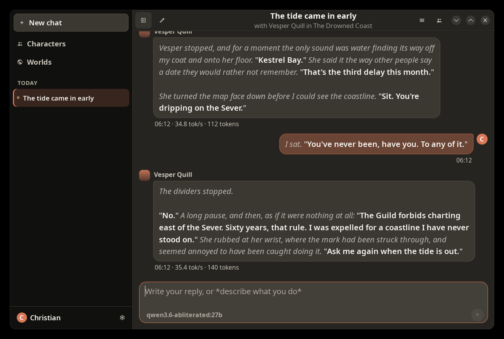

# Astral

A world roleplay system for local language models.

Astral lets you build characters, place them in a setting, and play out a scene
with them. Everything runs on your own machine through
[Ollama](https://ollama.com), so no part of a story is sent anywhere.

It is a GTK4 desktop application for Linux, built with libadwaita.



More in [`screenshots/`](screenshots/INDEX.md).

## What it does

**Characters.** Write one yourself, import a character card you already have,
or describe what you want and let the model interview you and write the card
for you. A character carries a description, a personality, the scenario a scene
opens in, and an opening message.

**Pictures.** A character can have two images: a small avatar shown beside
every message, and a larger portrait displayed beside the scene while you play.
If the model you are using can see images, you can also attach a reference
picture while designing a character and have it write the description from
what is actually in the image.

PNG, JPEG, WebP, GIF, BMP and TIFF are all accepted. Anything that is not
already PNG or JPEG is converted on import, because those are what a vision
model reads and what displays without an extra system package. Images with
transparency become PNG, and everything else becomes JPEG, so a photograph does
not grow tenfold on its way in.

**Scenes.** Pick a character and start playing. Astral keeps the transcript,
remembers which model a scene was started with, and reopens where you left off.

**Writing styles.** Named presets that control how the prose reads: sparse,
ornate, present tense, screenplay terse. Switch between them, write your own, or
have the model build one with you. A style changes the voice without touching
the structure of a scene.

**Instructions.** Rules you set, either for one character or for every scene.
"Keep replies to two paragraphs." "Never break the fourth wall." These are added
to Astral's own framing rather than replacing it, and are restated at the end of
the context on every turn, which is the position a model actually follows.

**Worlds and lorebooks.** A world is a setting, and its lorebook is everything
that is true there: people, places, organisations, how things work. Entries
carry trigger words and are only sent when the conversation touches them, so a
world can be far larger than the model can hold and still be consistent
whenever part of it comes up.

**The lorebook keeps itself.** Every few turns Astral asks the model what the
scene has established permanently, and writes it down. Facts, not events: that
Kestrel Bay is three days north and its ferries never run on time, not that
someone put a lantern down. Entries the model was unsure of are stored switched
off and wait for you to look at them, because an entry is permanent and reaches
every later scene that mentions its subject.

**Long scenes stay coherent.** When a story outgrows the model's context window,
Astral folds the older turns into a running record of what happened rather than
dropping them. Names, admissions, promises and unresolved threads survive. The
recent transcript stays word for word.

**Any model you have.** The picker lists whatever Ollama has installed, with
parameter size and quantization. Nothing is hardcoded to one model.

**Readable transcripts.** Narration, action and thought are set in a grey
italic. Speech is left plain and weighted. A long scene can be skimmed for what
was actually said out loud.

## Requirements

* Linux with GTK 4.10 or newer and libadwaita 1.4 or newer
* Go 1.26 or newer, to build
* [Ollama](https://ollama.com), running locally, with at least one model pulled

On Fedora:

```bash
sudo dnf install golang gtk4-devel libadwaita-devel
```

On Debian or Ubuntu:

```bash
sudo apt install golang libgtk-4-dev libadwaita-1-dev
```

On Arch:

```bash
sudo pacman -S go gtk4 libadwaita
```

## Install

```bash
git clone https://github.com/EternalCoder454/astral.git
cd astral
make install
```

That builds the binary, installs it to `~/.local/bin`, and adds a desktop entry
and icon so Astral appears in your application menu. Press the Super key and
type "Astral".

To build without installing:

```bash
make build    # produces ./bin/astral
make run      # build, then launch
make test     # the full test suite
```

To remove it:

```bash
make uninstall
```

Astral is single instance. If a copy is already open when you install a new
build, that copy keeps running the old one. Quit it and open it again.

## First run

Start Ollama and pull a model:

```bash
ollama serve
ollama pull qwen3:8b
```

Then open Astral and press **New chat**. You will be offered four ways in:

* **Design a character.** Describe whoever you have in mind, even vaguely. The
  model asks a couple of questions at a time and writes the card when it has
  enough. You review it before it is saved.
* **Play a scene.** Pick someone from your cast.
* **Just chat.** A plain conversation with the model, no character.
* **Import a character card.** Load a `.png` or `.json` card you already have.

While designing a character, a paperclip appears next to the model name if the
model supports vision. Attach a picture and the model will describe what it
sees. That image is offered as the character's portrait when the card is built.

Tell Astral who you are under **Settings, You**. Characters address you by that
name, and it is what `{{user}}` expands to.

## Worlds

Open **Worlds** in the sidebar (Ctrl+W) and create one. Its page is where you
play: give it a character, either by writing one who lives there or by moving
one you already have in, and every character listed on that page is one click
from a scene set in the world. Worlds you have made also appear on the home
screen, under the cast.

A scene started this way inherits the world's lorebook, and anything learned
while playing it is written back there. The window header says where you are,
so "with Vesper Quill in The Drowned Coast" is the confirmation that a lorebook
is in play.

Each entry has trigger words. The entry is sent when the recent conversation
mentions one of them, so only the relevant slice of a world costs context on
any given turn. Keep triggers specific: a common word matches everything and
spends the budget other entries needed, which is why Astral rejects trigger
words that are too short or too generic when the model proposes them.

An entry can also be marked to always send, for the handful of facts that apply
to every scene in the setting. Use it sparingly, since it costs its space on
every single turn.

Entries the model wrote are marked, with how confident it was. Below about
three quarters confident they arrive switched off and appear under "Waiting for
review" in the lorebook. Turning one on accepts it, and it then belongs to you:
no later automatic pass will overwrite it. The same protection covers anything
you write or edit by hand.

## Placeholders

Every text field expands placeholders, so a character or style can refer to
whoever is in the scene without naming them:

| | |
|---|---|
| `{{char}}` | the character being played |
| `{{user}}` | you |

Single braces work too, as do the older `<BOT>` and `<USER>` forms found in some
character cards. This matters most for writing styles, which apply to every
character and so should never name one.

## Character cards

Astral reads the character card format used across the local roleplay
ecosystem, in all three generations:

* `.json` cards
* `.png` cards, where the card is stored in the image metadata. Importing one
  keeps the portrait.
* V1 (flat), V2 (`chara_card_v2`), and V3 (`ccv3`)

Characters can be exported back out as V2 cards from the character editor, so
nothing you write here is locked in.

## Writing styles

The roleplay framing is in two halves. One is structural: whose turns are whose,
and the formatting convention the transcript is rendered from. That never
changes. The other is how the prose should sound, and that is the style.

**Default** is built in and cannot be edited or deleted, because it is what a
character falls back to. Everything else is yours. Open **Writing Styles**
(Ctrl+J) to write one, or pick **Design a writing style** from a new chat and
let the model interview you.

A style never needs to mention formatting. Astral handles that, and repeating it
only competes with the framing.

## Keeping it fast

Three things, in rough order of how much they matter:

* **The model stays loaded.** Ollama evicts a model five minutes after its last
  request, and roleplay has long gaps while you read and think. Astral asks for
  thirty minutes, so a pause does not cost a full model reload before the next
  reply starts. Adjustable under **Settings, Model**.
* **Only the recent transcript is sent word for word.** Older turns become the
  running record described above.
* **Example dialogue stops being sent.** A card's examples teach the voice
  before there is any. After six turns the real transcript does that better, so
  they are dropped.

Opening a chat builds only the most recent 120 messages, with the rest behind a
button, so a long scene opens as quickly as a short one.

## Where things live

| | |
|---|---|
| Database (characters, chats, messages) | `~/.local/share/astral/astral.db` |
| Imported portraits | `~/.local/share/astral/avatars/` |
| Settings | `~/.config/astral/config.json` |

The database is the data. It holds your transcripts, and nothing can rebuild it
from elsewhere. If it is ever found damaged it is moved aside rather than
deleted, and Astral says so.

Nothing leaves the machine. Astral talks to `localhost:11434` and nowhere else.

## Development

```
internal/ollama/   streaming /api/chat client, model listing, readiness probe
internal/imageconv/ decoding and normalising imported images
internal/world/    worlds, lorebook matching, and the automatic learning pass
internal/chars/    character model, card import and export, prompt assembly
internal/store/    SQLite (characters, chats, messages) and settings
internal/ui/       sidebar, transcript, composer, markup, icons
internal/app/      window, theming, settings, dialogs
```

Branches: `release` is stable, `beta` is where work lands first.

Environment variables for development:

| Variable | Effect |
|---|---|
| `ASTRAL_DEV_TITLE=1` | Pins a matchable window title for screenshot tools |
| `ASTRAL_DEV_SIZE=1400x900` | Fixed geometry, so runs are reproducible |
| `ASTRAL_DEV_VIEW=<name>` | Opens a surface on launch |
| `ASTRAL_DEV_CSS='<rules>'` | Appended to the stylesheet, to try a value without rebuilding |
| `ASTRAL_DEBUG_FONTS=1` | Dumps the resolved text rendering settings |

Views available to `ASTRAL_DEV_VIEW`: `welcome`, `newchat`, `designer`,
`styledesigner`, `assistant`, `characters`, `styles`, `settings`, `shortcuts`,
`about`, `model`, `rowmenu`, `demo`, `icons`, `measure`, `load=N`, and
`image=PATH`.

Any of these also makes the process non unique, so it will not hand off to a
copy you already have open. Point `XDG_DATA_HOME` at a temporary directory to
run against a throwaway database.

`go test ./...` includes several tests that talk to a real model. They skip
themselves when no Ollama server is reachable. `ASTRAL_TEST_MODEL` chooses which
model they use.

Icons are Material Symbols, shared with two sibling projects so the three look
alike. Sources live in `assets/icons-src/`, and `scripts/import-icons.sh`
produces the files the binary embeds. See `NOTICE` for licensing.

## Licence

MIT. See `LICENSE`.
