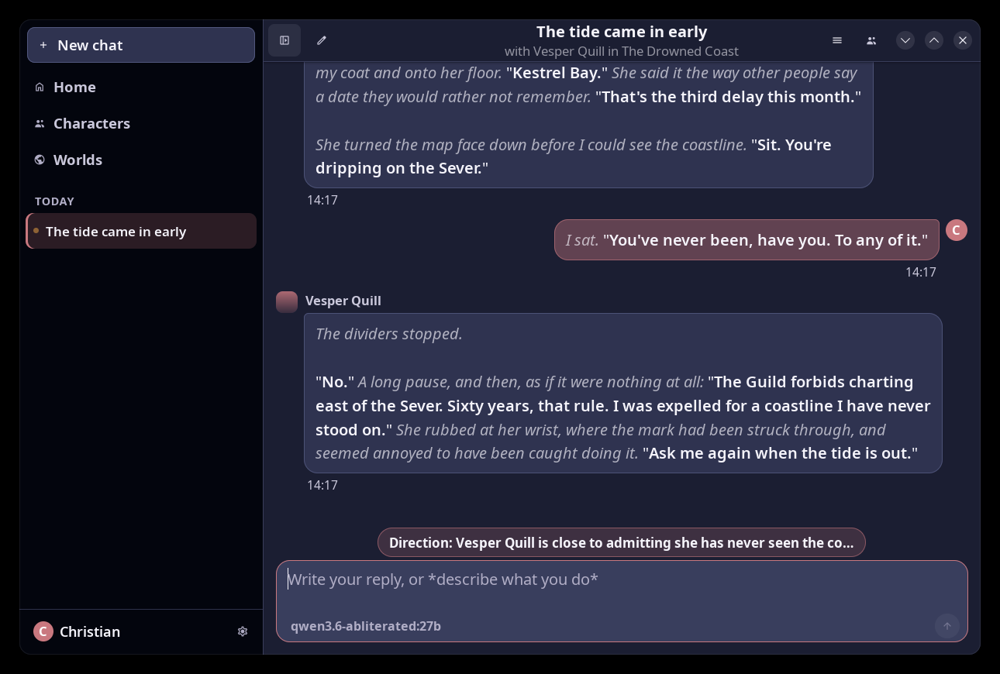

# Astral

A world roleplay system for local language models.

Astral lets you build characters, place them in a setting, and play out a scene
with them. Everything runs on your own machine through
[Ollama](https://ollama.com), so no part of a story is sent anywhere.

It is a GTK4 desktop application for Linux, built with libadwaita.



More in [`screenshots/`](screenshots/INDEX.md).

## What it does

**Characters.** Write one yourself, import a character card you already have,
or describe what you want and let the model interview you and write the card
for you. A character carries a description, a personality, the scenario a scene
opens in, and an opening message.

**Pictures.** A character can have two images: a small avatar shown beside
every message, and a larger portrait displayed beside the scene while you play.
While designing a character you can also give it a reference picture, and it
reads the person in it closely (apparent age, build, face, hair, clothing down
to material and wear, expression and posture) and builds the appearance from
what is actually there. Plain chats take pictures too.

The model you are talking to does not need to be able to see. When it cannot,
a model that can looks at the picture first and writes down what it shows,
and that description goes into the conversation in its place. Which model
looks is **Settings, Image Model**: Automatic picks the chat's own model when
it can see, and otherwise the largest one that can and that fits in video
memory by itself. Whatever is loaded is set aside while it looks and comes back
for the reply, so two models are never on the card together unless there is
room for both.

Almost any image format is accepted: PNG, JPEG, WebP, GIF, BMP and TIFF are
read directly, and HEIC, AVIF, JPEG XL, SVG, icons and the rest go through the
system's image loaders, so what is offered is whatever this machine can open.
Everything is converted on import to PNG or JPEG, which is what a vision model
reads, turned the right way up (a phone stores a portrait on its side), and
brought down to 1536 pixels on its longest side, which is more than a vision
model reads at and a fraction of the time to send.

**Scenes.** Pick a character and start playing. Astral keeps the transcript,
remembers which model a scene was started with, and reopens where you left off.

**Another take.** Writing the last reply again keeps the one before it. Arrows
under the reply flip between every version it has had, and the arrow past the
newest writes another, so a better first attempt is never lost to a worse
second one. Escape stops a reply partway, and what was written is kept.

**Finding a chat again.** The search box over the chat list (Ctrl+F) finds a
chat by its title or by anything said in it, and shows the line that matched.
While a slow model writes, you can get on with something else: Astral tells you
when the reply is done.

**Clearing out chats.** Ctrl and a click selects a chat in the list, Shift and a
click selects a run of them, and Select on a chat's menu (the dots that appear
when you point at it, or a right click) starts a selection without a keyboard.
While anything is selected, a click selects too, and the bar under the list
deletes them all (Delete) or lets them go (Escape). A deleted chat can be put
back with Undo on the message that follows, until that message goes away.

**Writing styles.** Named presets that control how the prose reads: sparse,
ornate, present tense, screenplay terse. Switch between them, write your own, or
have the model build one with you. A style changes the voice without touching
the structure of a scene.

The style is restated at the end of the context on every turn, not stated once
at the front, because by turn twenty the strongest instruction a model can see
is the transcript: twenty replies it wrote itself in the old style. Switching
styles mid-scene also says so outright, so the model stops imitating what came
before. Measured on a 24B model, the same opening under a terse style and a
lavish one returned 33 words and 305.

**Instructions.** Rules you set, either for one character or for every scene.
"Keep replies to two paragraphs." "Never break the fourth wall." These are added
to Astral's own framing rather than replacing it, and are restated at the end of
the context on every turn, which is the position a model actually follows.

**Worlds and lorebooks.** A world is a setting, and its lorebook is everything
that is true there: people, places, organisations, how things work. Entries
carry trigger words and are only sent when the conversation touches them, so a
world can be far larger than the model can hold and still be consistent
whenever part of it comes up.

**The lorebook keeps itself.** Every few turns Astral asks the model what the
scene has established permanently, and writes it down. Facts, not events: that
Kestrel Bay is three days north and its ferries never run on time, not that
someone put a lantern down. Entries the model was unsure of are stored switched
off and wait for you to look at them, because an entry is permanent and reaches
every later scene that mentions its subject.

**Long scenes stay coherent.** When a story outgrows the model's context window,
Astral folds the older turns into a running record of what happened rather than
dropping them. Names, admissions, promises and unresolved threads survive. The
recent transcript stays word for word.

**The context window is divided, not guessed at.** The character card, the
lorebook, the recap and the transcript all share one window, so Astral measures
the fixed parts and gives the rest to the scene, reserving room for the reply.
Nothing silently overflows. If a character's description is too long to fit on
its own, it says so rather than letting the server quietly drop the framing.

**The prompt is ordered for the cache.** Ollama reuses the work it has already
done for however much of a prompt is unchanged since last time, so everything
stable goes first and everything that moves goes last. Lore is matched against
what was recently said, so it changes most turns; moving it after the transcript
took the reusable share of a long scene's prompt from 12% to 89%, and put it in
the position a model weights most.

**Any model you have.** The picker lists whatever Ollama has installed, with
parameter size and quantization. Nothing is hardcoded to one model.

**A smaller model for the bookkeeping.** The scene recap and the lorebook pass
are not prose, and they run in the background after a reply, so whatever they
use is what your next message waits behind. Point them at a small model in
Settings and Ollama holds it in memory beside the one playing the scene. If it
stops fitting there and starts running on the CPU, Astral says so, because that
is the one hardware problem that otherwise just looks like the app getting
slower.

**Scene direction.** One line per chat saying where you want it to go: "she is
about to work out that he lied", "wind this down". It is sent at the very end
of the context, which is the position a model weights most, and it steers
without being said out loud in the story.

**Readable transcripts.** Narration, action and thought are set in a grey
italic. Speech is left plain and weighted. A long scene can be skimmed for what
was actually said out loud.

## Requirements

* Linux with GTK 4.10 or newer and libadwaita 1.4 or newer
* Go 1.26 or newer, to build
* [Ollama](https://ollama.com), running locally, with at least one model pulled

On Fedora:

```bash
sudo dnf install golang gtk4-devel libadwaita-devel
```

On Debian or Ubuntu:

```bash
sudo apt install golang libgtk-4-dev libadwaita-1-dev
```

On Arch:

```bash
sudo pacman -S go gtk4 libadwaita
```

## Install

### Windows

Download the installer from the
[releases page](https://github.com/EternalCoder454/astral/releases) and run it.
It installs for you alone and asks for no administrator rights.

You still need [Ollama](https://ollama.com) running, and at least one model
pulled. Astral tells you if it cannot find either.

GTK links Vulkan on Windows, so Astral needs a graphics driver that provides
it. Any current Intel, AMD or NVIDIA driver does. A virtual machine running on
Microsoft's basic display adapter does not, and Astral will not start there.

Windows builds are made on a Windows runner with the same GTK and libadwaita
that GTK itself is packaged with there. libadwaita is a GNOME library and
Windows is not a platform GNOME supports, so treat this as the less-travelled
path of the two.

### Your phone

Astral can serve its library and its models to another device on the same
network. The phone is the screen; this machine stays the computer, because a
27B model does not run on a phone.

Open Settings, then Phone access, and switch it on. It shows an address to open
on the phone and, when you press Start pairing, a code to type into it. The
phone keeps a token after that and stays signed in. Paired devices are listed
there and can be removed, which takes effect on the next request they make.

A reply is written on your PC, not over the connection, so a phone that locks
its screen or drops off the Wi-Fi mid-reply does not lose it: the PC finishes
and stores it, and the phone picks it up when you come back. Send turns into
Stop while a reply is written, and Back closes a chat rather than the app. A
character with a portrait is shown behind their scene, with the messages
tinted over it so they still read.

Any phone browser works. The
[Android app](https://github.com/EternalCoder454/astral/releases) is the same
interface with an icon, a full screen and the address remembered. It is
sideloaded: Android will ask you to allow installing it, because it does not
come from a store.

The app is signed with a key held in this repository's secrets, not in the
repository. That is what makes one build an update to the last rather than a
different app wearing its name: Android refuses to replace an app with one
signed differently, which is what "App not installed as package conflicts with
an existing package" means. Builds up to 0.4.0 were each signed with a
throwaway key, so upgrading from one of those needs the old app uninstalled
once. After that they update in place.

The app updates itself from its own settings. It asks your PC what the newest
version is, downloads it through your PC rather than from the internet, and
hands it to Android's installer. Android asks once for permission to do that,
and refuses any build not signed with the same key as the one already
installed, so a file altered on the way across your network is rejected by the
system rather than trusted by Astral.

Your library and your conversations never leave your network. There is no
account, no server belonging to anyone else, and with phone access switched off
nothing is listening.

### Linux

```bash
git clone https://github.com/EternalCoder454/astral.git
cd astral
make install
```

That builds the binary, installs it to `~/.local/bin`, and adds a desktop entry
and icon so Astral appears in your application menu. Press the Super key and
type "Astral".

To build without installing:

```bash
make build    # produces ./bin/astral
make run      # build, then launch
make test     # the full test suite
```

To remove it:

```bash
make uninstall
```

Astral is single instance. If a copy is already open when you install a new
build, that copy keeps running the old one. Quit it and open it again.

## Updates

Astral checks once on launch whether a newer version has been published, and
says so if there is one. It reads a single text file from this repository and
sends nothing about your machine, your characters or your scenes. Switch it off
under **Settings, Appearance**, along with the channel:

- **Release** is the tested one, and the default.
- **Beta** is ahead of it and may be rough.

Updating fetches the branch into a clone under your data directory, rebuilds,
and restarts. It never touches a checkout you are working in. Building from
source rather than downloading a binary is slower, and means what you end up
running was built against the GTK and libadwaita on your own machine, which is
the thing that actually breaks when a binary is carried between distributions.

`WHATSNEW.md` is what the update dialog shows: one heading per version, a few
plain lines each. The git log is the technical history.

## First run

Start Ollama and pull a model:

```bash
ollama serve
ollama pull qwen3:8b
```

Then open Astral and press **New chat**. You will be offered four ways in:

* **Design a character.** Describe whoever you have in mind, even vaguely. The
  model asks a couple of questions at a time and writes the card when it has
  enough. You review it before it is saved.
* **Play a scene.** Pick someone from your cast.
* **Just chat.** A plain conversation with the model, no character.
* **Import a character card.** Load a `.png` or `.json` card you already have.

While designing a character, a paperclip appears next to the model name. Attach
a picture, drop one on the chat, or paste one, and the designer reads it and
builds from it. That image is offered as the character's portrait when the card
is built.

Tell Astral who you are under **Settings, You**. Characters address you by that
name, and it is what `{{user}}` expands to.

## Worlds

Open **Worlds** in the sidebar (Ctrl+W) and create one. Its page is where you
play: give it a character, either by writing one who lives there or by moving
one you already have in, and every character listed on that page is one click
from a scene set in the world. Worlds you have made also appear on the home
screen, under the cast.

A scene started this way inherits the world's lorebook, and anything learned
while playing it is written back there. The window header says where you are,
so "with Vesper Quill in The Drowned Coast" is the confirmation that a lorebook
is in play.

Each entry has trigger words. The entry is sent when the recent conversation
mentions one of them, so only the relevant slice of a world costs context on
any given turn. Keep triggers specific: a common word matches everything and
spends the budget other entries needed, which is why Astral rejects trigger
words that are too short or too generic when the model proposes them.

An entry can also be marked to always send, for the handful of facts that apply
to every scene in the setting. Use it sparingly, since it costs its space on
every single turn.

Entries the model wrote are marked, with how confident it was. Below about
three quarters confident they arrive switched off and appear under "Waiting for
review" in the lorebook. Turning one on accepts it, and it then belongs to you:
no later automatic pass will overwrite it. The same protection covers anything
you write or edit by hand.

## Knowledge

Open **Knowledge** in the sidebar. It holds notes, saved pages and study notes,
and General Chat and the three designers draw on it without being asked: each
message is matched against it, and the few passages that fit are put in front of
the model with where they came from and how old they are.

There are four ways in. **Write an entry** by hand. **Import** text or Markdown
files. **Save to Knowledge** from any reply in General Chat or a designer. Or
**Study a Topic**: Astral searches the web, reads the best few pages, keeps them,
and has the model write notes from only what those pages say, with numbered
sources. Web searches made during a conversation keep the pages they open, too,
so a subject looked up once is known the next time without searching again.

It searches by the words in an entry, which works on any machine. Install an
embedding model (`ollama pull embeddinggemma` is small) and it searches by
meaning as well, blending the two. Scenes never use it: a note about a library
has no business in a tavern.

## Prompts

Everything Astral asks of a model is a prompt, and **Prompts** in the sidebar
lists every one of them: how a scene is framed, the reminder at the end of each
turn, the three designers, the recap, the lorebook, reading pictures, study
notes and the rest. Open one to read it as it is sent, change it by hand, or
press **Optimize** to work on it with the Prompt Optimizer.

The optimizer is a design chat whose product is a better prompt. It has the
prompt in front of it along with a list of every other one, and reads any of them
when it needs to, including the last request of each kind exactly as it went out,
with the character's card, the recap and the reminders in it. It says where the
prompt is likely to fail with a small local model and writes a better version;
**Save Prompt** puts that version to work everywhere the prompt is sent. The
original can be put back from the same page at any time. The **+** at the top
takes a prompt of your own instead, and **Copy Prompt** gives you the result.

**Optimize All** runs the optimizer over every prompt, one at a time, with the
model you chat with, in the background while you do something else. Nothing
changes until you review what it wrote: each rewrite can be compared with the
prompt as it is now, and ticked or left. A rewrite that drops a name Astral fills
in, invents a slot Astral does not fill, or uses dashes is flagged and starts
unticked.

The optimizer works best with a strong model. A small one tends to make a prompt
shorter by dropping rules that were there for a reason, so read before you save.

Your versions are kept in the database, so they are in the daily backups too.

## Web search

On by default for every conversation except a scene: General Chat, the designers
and the Prompt Optimizer. The model decides when to search, prefers primary and
reputable sources over pages written to rank, and can open a result to read the
whole page instead of answering from a two line snippet. What leaves your machine
is the words it searches for and the pages it opens; no part of your
conversation, characters or worlds. Every reply that searched says what it looked
up.

What it finds worth keeping it can save to **Knowledge**, where later
conversations will find it, and the reply says when it has. It saves only what it
looked up, never the character or world you are designing, which have their own
buttons.

With your own [SearXNG](https://docs.searxng.org) running, searches go there.
Without one they go to DuckDuckGo, so search works on a fresh install. Choose
under **Settings, Model, Web Search**, or switch it off there.

## Long scenes

A scene that outgrows the context window keeps its recent turns word for word
and folds the rest into a written recap. The recap keeps the plot and loses the
details: the name of the ship, the exact promise. So every message is indexed
too, and each turn the few older moments that what is happening now touches are
recalled beside the recap.

Characters also settle into habits over a long scene: the same gesture every
third reply, the same simile, the same swear word. Astral reads the recent
replies, finds the phrasing they keep reusing, and asks the next reply for
something else. Names and objects may repeat; the wording around them should
not.

## Placeholders

Every text field expands placeholders, so a character or style can refer to
whoever is in the scene without naming them:

| | |
|---|---|
| `{{char}}` | the character being played |
| `{{user}}` | you |

Single braces work too, as do the older `<BOT>` and `<USER>` forms found in some
character cards. This matters most for writing styles, which apply to every
character and so should never name one.

## Character cards

Astral reads the character card format used across the local roleplay
ecosystem, in all three generations:

* `.json` cards
* `.png` cards, where the card is stored in the image metadata. Importing one
  keeps the portrait.
* V1 (flat), V2 (`chara_card_v2`), and V3 (`ccv3`)

Characters can be exported back out as V2 cards from the character editor, so
nothing you write here is locked in.

## Writing styles

The roleplay framing is in two halves. One is structural: whose turns are whose,
and the formatting convention the transcript is rendered from. That never
changes. The other is how the prose should sound, and that is the style.

**Default** is built in and cannot be edited or deleted, because it is what a
character falls back to. Everything else is yours. Open **Writing Styles**
(Ctrl+J) to write one, or pick **Design a writing style** from a new chat and
let the model interview you.

A style never needs to mention formatting. Astral handles that, and repeating it
only competes with the framing.

## Keeping it fast

In rough order of how much they matter:

* **The model loads while you type.** Astral follows Ollama's own keep-alive
  rather than overriding it, so after a long pause the model may have been
  unloaded. The first keystroke starts loading it again, so the wait happens
  while you write instead of after you send. It only does this when the model
  fits beside what is already in video memory. To keep a model loaded longer,
  set **Keep the Model Loaded For** under **Settings, Model**.
* **One model at a time.** Switching models releases the previous one, and the
  background model for recaps and lore is used only when it fits beside the
  scene's model. On Linux with an AMD card, a model that does not fit freezes
  the desktop rather than slowing down, so if you use Ollama for anything else
  as well, setting `OLLAMA_MAX_LOADED_MODELS=1` on the Ollama service is the
  safest guard of all.
* **Replies stream straight away.** In a conversation that can search, the
  answer streams as it is written; it is only held back in the rare turn where
  the model decides to search first.
* **Only the recent transcript is sent word for word.** Older turns become the
  running record described above.
* **Example dialogue stops being sent.** A card's examples teach the voice
  before there is any. After six turns the real transcript does that better, so
  they are dropped.

Opening a chat builds only the most recent 120 messages, with the rest behind a
button, so a long scene opens as quickly as a short one.

## Where things live

| | |
|---|---|
| Database (characters, chats, messages) | `~/.local/share/astral/astral.db` |
| Daily backups of it | `~/.local/share/astral/backups/` |
| Imported portraits | `~/.local/share/astral/avatars/` |
| Settings | `~/.config/astral/config.json` |

The database is the data. It holds your transcripts, and nothing can rebuild it
from elsewhere. If it is ever found damaged it is moved aside rather than
deleted, and Astral says so. A copy of it is also made once a day and the last
seven are kept, so a scene deleted by mistake can be had back: quit Astral and
copy one of them over `astral.db`. **Settings, About** opens the folder.

Your library stays on this machine. Everything to do with a model goes to Ollama
at `localhost:11434`, and Astral reaches anywhere else in three cases only:

* **Web search**, while it is on. The model's search queries go to your SearXNG
  or to DuckDuckGo, and the pages it chooses to read are fetched. Switch it off
  under **Settings, Model, Web Search**.
* **The update check** at launch, which reads one text file from GitHub and sends
  nothing about you. Switch it off under **Settings, About**.
* **Updating the phone app**, which your PC downloads from GitHub on the phone's
  behalf when you ask it to.

## Development

```
internal/ollama/   streaming /api/chat client, model listing, readiness probe
internal/imageconv/ decoding and normalising imported images
internal/world/    worlds, lorebook matching, and the automatic learning pass
internal/chars/    character model, card import and export, prompt assembly
internal/store/    SQLite (characters, chats, messages) and settings
internal/ui/       sidebar, transcript, composer, markup, icons
internal/app/      window, theming, settings, dialogs
```

Branches: `release` is stable, `beta` is where work lands first.

### Versioning

`internal/app/version.go` is the single source of truth. The Makefile reads it,
so `go build .` and `make install` cannot report different numbers at each
other, and the update check compares against it.

Versions are `major.minor.patch`. Patch is a fix, minor is anything anyone
would notice, major is reserved for a break in the database or the card format.

To cut a release:

```bash
# 1. Bump the number
$EDITOR internal/app/version.go

# 2. Add the entry people will actually read. Newest heading first,
#    at most eight lines, each under 110 characters. The tests enforce both.
$EDITOR WHATSNEW.md

# 3. Check that what you wrote will parse and display
go test ./internal/update/

# 4. Tag it and move release forward
git commit -am "Release 0.3.0"
git tag -a v0.3.0 -m "0.3.0"
git push origin beta --tags
git checkout release && git merge --ff-only beta && git push origin release

# 5. When the windows and android workflows have both finished, publish the
#    release they attached their files to. It is a draft until then, and a
#    draft's files cannot be downloaded: the phone's update fails with 502.
gh release edit v0.3.0 --draft=false --latest
```

Anyone on the release channel is offered it on their next launch; anyone on
beta was offered it when it landed there: the desktop's update check reads
`WHATSNEW.md` from the branch, so for the window, publishing is the merge. The
phone's update downloads the APK from the GitHub release, which is why step 5
matters. Both build jobs attach to the same release, so it is created as a draft
and published once both are done.

Environment variables for development:

| Variable | Effect |
|---|---|
| `ASTRAL_DEV_TITLE=1` | Pins a matchable window title for screenshot tools |
| `ASTRAL_DEV_SIZE=1400x900` | Fixed geometry, so runs are reproducible |
| `ASTRAL_DEV_VIEW=<name>` | Opens a surface on launch |
| `ASTRAL_NO_UPDATE_CHECK=1` | Never checks for a new version |
| `ASTRAL_UPDATE_NOTES_URL=<url>` | Reads release notes from somewhere else, for testing the update path |
| `ASTRAL_DEV_CSS='<rules>'` | Appended to the stylesheet, to try a value without rebuilding |
| `ASTRAL_DEBUG_FONTS=1` | Dumps the resolved text rendering settings |

Views available to `ASTRAL_DEV_VIEW`: `welcome`, `newchat`, `designer`,
`styledesigner`, `assistant`, `characters`, `styles`, `settings`, `shortcuts`,
`about`, `model`, `rowmenu`, `demo`, `drop`, `knowledge`, `study`, `icons`,
`measure`, `load=N`, and `image=PATH`.

Any of these also makes the process non unique, so it will not hand off to a
copy you already have open. Point `XDG_DATA_HOME` at a temporary directory to
run against a throwaway database.

`go test -short ./...` never talks to a model. Without `-short`, the live tests
run too, and they are strict about it, because on Linux with an AMD card a model
that does not fit in video memory freezes the desktop: they never choose a model
themselves (`ASTRAL_TEST_MODEL` has to name one), refuse anything over 8 GB
unless `ASTRAL_TEST_ALLOW_LARGE` is set, and refuse anything that would not fit
beside what is already loaded. See `internal/livetest`.

Icons are Material Symbols, shared with two sibling projects so the three look
alike, apart from the Knowledge book, which is drawn for Astral in the same
coordinate system. Sources live in `assets/icons-src/`, and `scripts/import-icons.sh`
produces the files the binary embeds. See `NOTICE` for licensing.

## Licence

MIT. See `LICENSE`.
